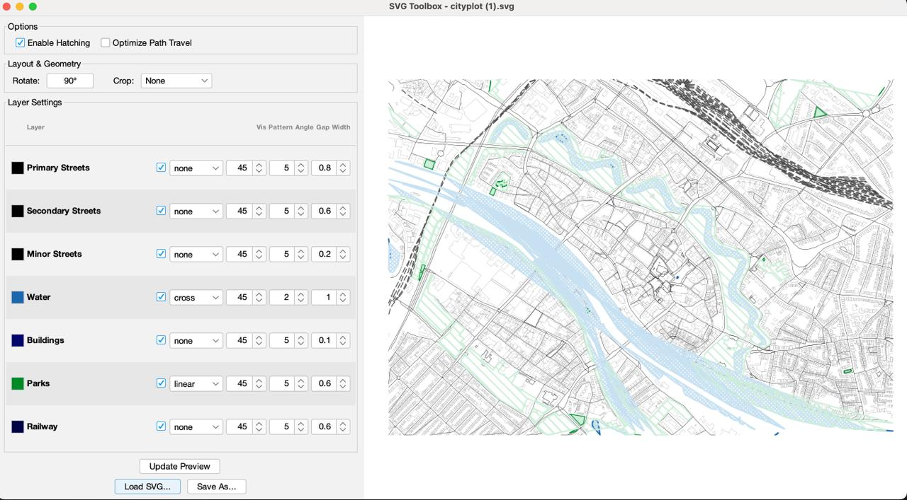
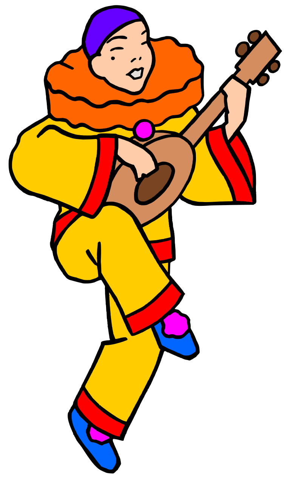
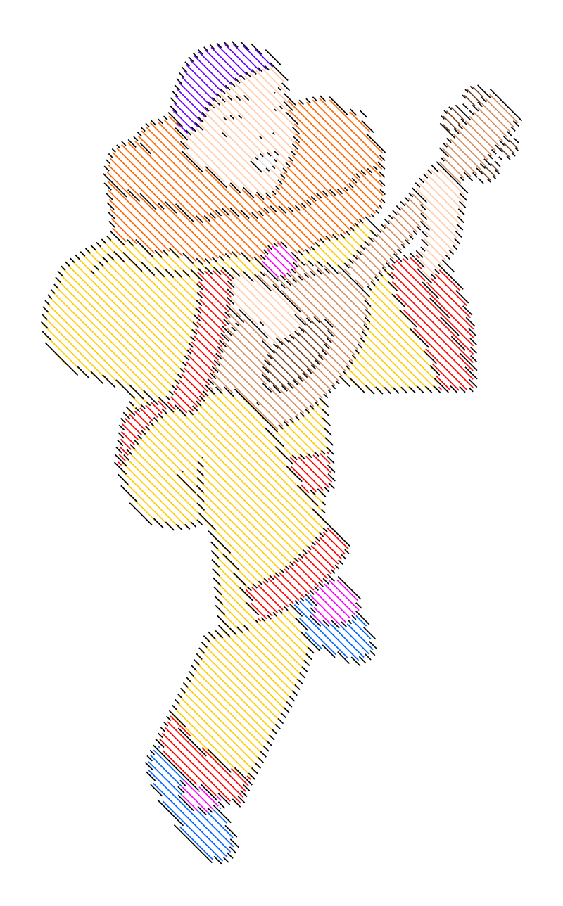

# SVGToolBox

A modular Java CLI + GUI tool that bridges generative vector art and physical pen plotters.

SVGToolBox takes SVG files designed for screens — with solid fills and infinite colors — and transforms them for the physical world. It quantizes colors to match your pen collection, converts fills into hatch patterns via scanline geometry, optimizes path order to minimize pen travel, and organizes output into Inkscape-compatible layers.

Built for pen plotters like the AxiDraw, iDraw, and similar HPGL/G-Code devices.



## Pipeline Architecture

```
Input SVG → Visibility → StyleNormalizer → Rotate → StrokeWidth → Palette → Simplify → Hatch → Layer → Crop → PathOptimize → Output SVG
```

Each stage is a `Processor` that modifies the SVG DOM in-place. The pipeline is linear, stateless, and extensible.

| Processor | Purpose |
|---|---|
| **VisibilityProcessor** | Hide/show layers based on export visibility settings |
| **StyleNormalizerProcessor** | Convert CSS classes to inline attributes for reliable downstream processing |
| **RotateProcessor** | Rotate canvas 90°/180°/270° |
| **StrokeWidthProcessor** | Normalize line weights to physical pen tip size (global or per-layer) |
| **PaletteProcessor** | Quantize colors to available pens (perceptual color matching) |
| **SimplifyProcessor** | Reduce path complexity (Ramer-Douglas-Peucker) |
| **HatchProcessor** | Convert fills to line patterns (scanline, world-space baking) |
| **LayerProcessor** | Flatten groups into Inkscape layers, auto-fit viewBox |
| **CropProcessor** | Crop to A4, Letter, or custom dimensions |
| **PathOptimizeProcessor** | Reorder paths to minimize pen travel using Apache Batik for precise coordinate parsing and greedy nearest neighbor sorting |

## Prerequisites

- **Java 17** or higher
- **Maven 3.8+**

## Build

```bash
./build.sh
```

Alternatively, use maven directly:
```bash
mvn clean package
```

The executable Uber-JAR will be at `target/svgtoolbox-1.0-SNAPSHOT.jar`.

Or use the install script to build and create a global alias:

```bash
./install.sh
```

## Usage

### CLI

```bash
svgtoolbox -i input.svg -o output.svg [options]
```

### GUI

```bash
./start_gui.sh        # Linux/macOS
.\start_gui.bat       # Windows
```

Requires a display environment (X11/Wayland). Uses Java Swing with FlatLaf Material Design theming and live preview. Each layer has its own independent controls for hatch pattern, angle, gap, stroke width, and export visibility — no global settings needed. Stroke width uses precise spinner controls with +/- buttons. The heavy generative processing runs asynchronously, ensuring the application remains responsive during optimization.

### Core Options

| Flag | Description | Default |
|---|---|---|
| `-i, --input` | Source SVG file (required) | — |
| `-o, --output` | Output path (required) | — |
| `-p, --palette` | Pen colors, comma-separated hex | — |
| `-w, --stroke-width` | Stroke width in px | 1.0 |
| `-h, --hatch` | Enable hatching engine | off |
| `--pattern` | Global hatch pattern (none, empty, linear, cross, zigzag, wave, dot) | linear |
| `--optimize` | Optimize path order | off |
| `--rotate` | Rotate 90/180/270° | — |
| `--crop` | Crop to A4, Letter, or WxH | — |
| `--stats` | Print geometry statistics | off |

### Hatching Options

| Flag | Description | Default |
|---|---|---|
| `--hatch-angle` | Line angle in degrees | 45.0 |
| `--hatch-gap` | Line spacing in px | 5.0 |
| `--no-hatch` | Colors to skip (outline only) | — |
| `--min-area` | Min shape area to hatch (px²) | 100 |
| `--simplify` | RDP tolerance (0 = off) | 0 |

### Per-Color Styling

```bash
-S, --style "HEX:ANGLE:GAP:PATTERN;..."
--layer-width "HEX:WIDTH;HEX:WIDTH"
--hidden-layers "HEX,HEX"
```

Example — three pens with different treatments:

```bash
svgtoolbox \
  -i input.svg -o output.svg \
  -p "#00FFFF,#FF00FF,#000000" \
  -h -w 0.5 \
  --style "#00FFFF:45:6.0:linear;#FF00FF:135:4.0:linear;#000000:0:8.0:cross" \
  --simplify 1.0 --min-area 100
```

## Before / After

| Input | Processed |
|-------|-----------|
|  |  |

*Left: Raw SVG input. Right: After SVGToolBox processing (palette reduction, stroke normalization, path optimization).*

## Examples

**Quick single-color plot:**
```bash
svgtoolbox -i raw.svg -o plot.svg -p "#000000" -w 0.5 -h
```

**Logo with selective hatching** (hatch red, keep black as outlines):
```bash
svgtoolbox -i logo.svg -o out.svg -p "#FF0000,#000000" -h --no-hatch "#000000"
```

## Tech Stack

- **Java 17** — Language
- **Apache Batik 1.19** — SVG parsing and DOM manipulation
- **Commons CLI 1.6** — Argument parsing
- **Maven** — Build system with Shade plugin (Uber-JAR)
- **JUnit 5 + Mockito** — Testing

## Project Structure

```
src/main/java/org/trostheide/svgtoolbox/
├── SvgToolboxRunner.java      # CLI entry point
├── Config.java                # Immutable configuration record
├── HatchStyle.java            # Per-color hatch settings
├── Processor.java             # Processor interface
├── core/
│   ├── ShapeParser.java       # Geometry extraction
│   ├── SvgAnalyzer.java       # Layer detection and SVG structure analysis
│   └── SvgStatistics.java     # Layer statistics
├── processors/                # Pipeline stages
│   ├── VisibilityProcessor
│   ├── StrokeWidthProcessor
│   ├── PaletteProcessor
│   ├── SimplifyProcessor
│   ├── HatchProcessor
│   ├── CropProcessor
│   ├── RotateProcessor
│   ├── PathOptimizeProcessor
│   ├── StyleNormalizerProcessor
│   └── LayerProcessor
├── patterns/                  # Hatch pattern generators
│   ├── LinearHatchPattern
│   ├── CrossHatchPattern
│   ├── ZigZagHatchPattern
│   ├── WaveHatchPattern
│   └── DotHatchPattern
└── ui/                        # Swing GUI
    ├── GuiRunner
    ├── MainWindow
    ├── PreviewPanel
    └── ControlPanel
```

## Troubleshooting

| Problem | Cause | Fix |
|---|---|---|
| Huge output file (>2MB) | Geometry baking + dense hatch | Increase `--hatch-gap`, use `--min-area 500` |
| Solid blocks / moiré | Stroke too thick for gap density | Use `-w 0.5`, increase gap |
| Colors not separating | CSS classes instead of attributes | Export with "Presentation Attributes" |

## License

AGPL-3.0 — see [LICENSE](LICENSE).

## Contributing

See [CONTRIBUTING.md](CONTRIBUTING.md).
